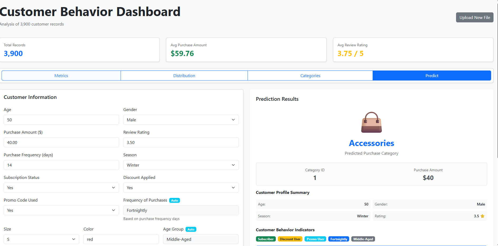
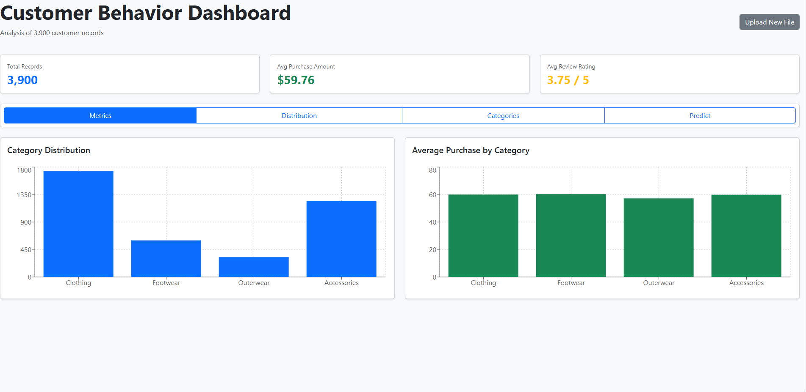
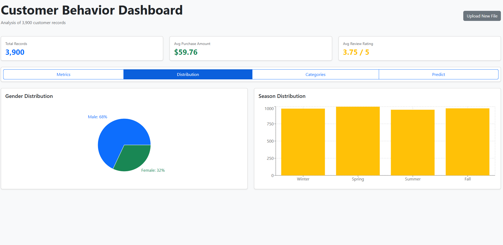

# 🧠 Customer Behaviour Analytics  
### Data Preprocessing • Machine Learning • FastAPI • React Dashboard
An end-to-end project predicting customer purchase categories and visualizing insights through an interactive web dashboard.
---
##  Overview

This project integrates **machine learning and full-stack development** to analyze and predict customer purchase behavior based on shopping data.  
It has **two main components**:

  
  
  
  

1. **Data Science & ML Pipeline** – implemented in Jupyter notebooks (exported as Python scripts):  
   - Data cleaning, feature engineering, and storage in PostgreSQL  
   - Model training with **XGBoost** and **SMOTE**  
   - Model export (`customer_behavior_model.pkl`)  

2. **Interactive Web Dashboard** – implemented with **FastAPI (backend)** and **React (frontend)**:  
   - FastAPI exposes a `/predict` endpoint that returns category predictions and probabilities  
   - React dashboard visualizes analytics and lets users submit new prediction requests based on ML model developed in phase 1 

---

##  Machine Learning Workflow

### 1️⃣ Data Preprocessing (`customerbehaviouranalytics.py`)
- Reads raw dataset **`customer_shopping_behavior.csv`**
- Cleans columns (lowercase, rename, fill missing median review ratings)
- Maps purchase frequency text → numeric days
- Creates age_group and purchase_frequency_days
- Saves cleaned file as `cleaned_processed_customer_data.csv`
- Writes the cleaned dataset into a PostgreSQL table using SQLAlchemy

### 2️⃣ Model Training (`mlprediction.py`)
- Loads cleaned dataset  
- Creates derived behavioral features:
  - Spending & frequency (`avg_spent_per_day`, `price_per_frequency`)
  - Value segmentation (`customer_value`, `high_value_customer`)
  - Discount & loyalty indicators (`deal_seeker`, `loyalty_score`)
- Encodes categorical features with **OneHotEncoder** and scales numeric ones
- Handles class imbalance using **SMOTE**
- Trains **XGBoostClassifier** (multi-class) with tuned hyperparameters  
- Evaluates accuracy, macro-F1, and cross-validation scores  
- Exports full preprocessing + model pipeline to `customer_behavior_model.pkl`

---

## ⚙️ Backend – FastAPI 

### Key Features
- Loads the trained model pipeline  
- Defines a `CustomerInput` Pydantic schema for input validation  
- Predicts category + probabilities for four labels:
  - Clothing
  - Accessories
  - Footwear
  - Outerwear
    
## How to Run

### 1️⃣ Backend 
# Create virtual environment
python -m venv .venv
source .venv/bin/activate  # or .venv\Scripts\activate on Windows

# Install dependencies
pip install fastapi uvicorn pandas scikit-learn xgboost imbalanced-learn joblib psycopg2-binary sqlalchemy

# Start FastAPI server
python server.py

###2️⃣ Frontend
# Navigate to client directly
cd client
# Install dependencies
npm install
# Start React app
npm start

3️⃣ Jupyter / ML Workflow (Optional:to inspect ml workflow)

jupyter notebook
# or run exported scripts
python customerbehaviouranalytics.py
python mlprediction.py

